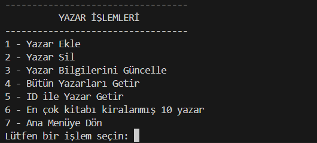
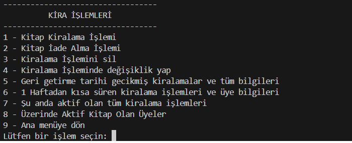
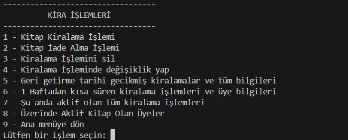
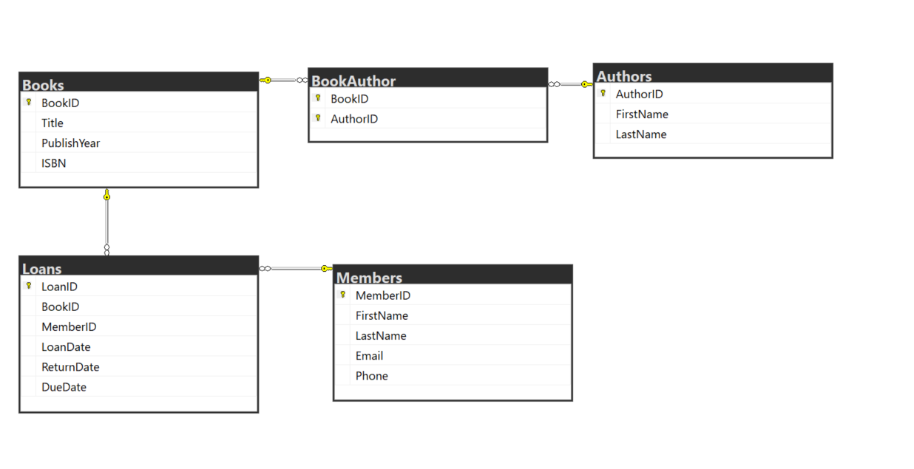
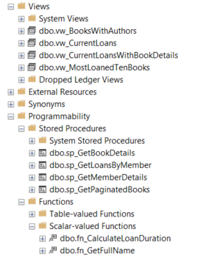

# 📚 Library Management System

Bu proje, ADO.NET ile geliştirilmiş bir **konsol tabanlı kütüphane yönetim sistemidir**. Kitap, yazar, üye ve kiralama işlemlerini yönetmenizi sağlar.
CRUD işlemlerini ve gelişmiş sorgulama sistemlerini uygulamanıza olanak sağlar.

## 🛠️ Kullanılan Teknolojiler

- C#
- ADO.NET
- SQL Server
- .NET 9.0
- Konsol Uygulaması (Console App)
- Veritabanı işlemleri:ADO.NET ile bağlantı,Viewlar, User Defined functionlar,Stored Procedureler

## 📸 Ekran Görüntüleri

 ### Ana menü görünümü:

### Kitap işlemleri ekranı:

### Yazar işlemleri ekranı:

### Kiralama işlemleri ekranı:

### Üye işlemleri ekranı:

### Database diagram:

### Database Structures:

## 🗄️ Veritabanı Kurulumu

Projeyi kullanmadan önce aşağıdaki adımları takip ederek veritabanınızı oluşturabilirsiniz.

📁 1. .bak Dosyası ile Kurulum (Tavsiye Edilen)

Bu yöntem, veritabanı yapısını ve verileri eksiksiz olarak yükler.

Adımlar:

SQL Server Management Studio'yu (SSMS) açın.

"Databases" bölümüne sağ tıklayın ve Restore Database... seçeneğine tıklayın.

Device seçeneğini işaretleyin ve LibraryManagement.bak dosyasını ekleyin.

Restore işlemini başlatın.

Veritabanı adını LibraryManagement olarak belirleyin.

⚠️ Not: Projede yer alan _connectionString doğrudan LibraryManagement isimli veritabanına bağlandığı için, bağlantı ayarında ekstra bir değişiklik yapmanıza gerek yoktur.
⚠️ Not: Farklı bir veritabanı adı kullanırsanız, DB.cs dosyasındaki _connectionString içindeki Database=... alanını güncellemeniz gerekir.

🔧 2. .sql Scripti ile Kurulum (Alternatif Yöntem)

Eğer .bak dosyasını kullanarak restore işlemi yapamıyorsanız, bu seçeneği kullanarak yalnızca veritabanı yapısını oluşturabilirsiniz. (Veriler bu yöntemle yüklenmez!)

Adımlar:

SQL Server Management Studio'yu (SSMS) açın.

"Databases" bölümüne sağ tıklayın ve New Database... seçeneğine tıklayın.

Veritabanı adını LibraryManagement olarak belirleyin ve oluşturun.

LibraryManagement.sql dosyasını açıp çalıştırın.

Tüm tabloların ve yapıların oluştuğundan emin olun.

⚠️ Not: Farklı bir veritabanı adı kullanırsanız, DB.cs dosyasındaki _connectionString içindeki Database=... alanını güncellemeniz gerekir.

🔹 Özet

📅 .bak dosyası kullanırsanız verilerle birlikte tam veritabanı kurarsınız.

🖊️ .sql scripti kullanırsanız sadece tablo yapıları oluşur.

📢 Tavsiyemiz: Mümkünse .bak dosyası ile restore işlemi yapın, bu sayede projeyi içinde veri bulunan bir veritabanı ile hazır kullanabilirsiniz.
